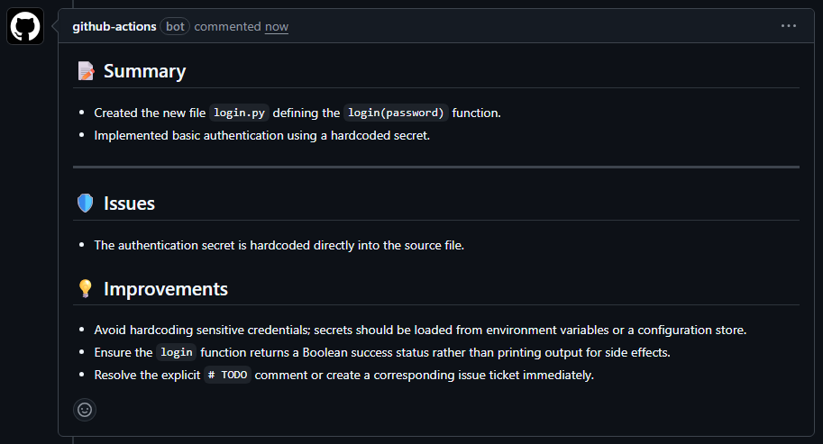

# Gemini PR Agent

A GitHub Action that uses Google Gemini to generate PR descriptions and code reviews. It focuses on catching bugs and suggesting clean code improvements without the fluff.

---

## 🛠️ Functionality

- **Auto-Summary**: Summarizes changes in bullet points.
- **Code Review**: Checks for bugs and security risks.
- **Smart Suggestions**: Suggests the **Top 3** code quality improvements (e.g., naming, DRY).

---

## 💰 Pricing & Quotas (Free vs Paid)

This action defaults to the **Gemini 1.5 Flash** model.

| Tier          | Rate Limit                                                     | Cost                                                           |
| :------------ | :------------------------------------------------------------- | :------------------------------------------------------------- |
| **Free Tier** | 15 RPM (Requests Per Minute) <br> 1,500 RPD (Requests Per Day) | **Free**                                                       |
| **Paid**      | 2,000+ RPM                                                     | **$0.075** / 1M input tokens <br> **$0.30** / 1M output tokens |

### ⚡ How to Upgrade

If you hit the rate limits (e.g., for a large enterprise repo), you can switch to the paid tier:

1. Go to the [Google Cloud Console](https://console.cloud.google.com/).
2. Link a billing account to your project.
3. The API automatically switches to "Pay-as-you-go" limits.

---

## 🚀 Setup For Your Repo

### 1. API Key

Get an API Key from [Google AI Studio](https://aistudio.google.com/).

### 2. Add Secret

Go to **Settings > Secrets and variables > Actions** in your repo.

- Name: `GEMINI_API_KEY`
- Value: _Your API Key_

### 3. Add Workflow

[Download ai-agent.yml](./ai-agent.yml) and place it in `.github/workflows/`, or create the file manually:

```yaml
name: AI Agent

on:
  pull_request:
    types: [opened]

permissions:
  contents: read
  pull-requests: write

jobs:
  ai_agent:
    runs-on: ubuntu-latest
    steps:
      - name: Checkout Code
        uses: actions/checkout@v4
        with:
          fetch-depth: 0

      - name: Run Gemini Agent
        uses: daizzah/gemini-pr-agent@main
        with:
          gemini_api_key: ${{ secrets.GEMINI_API_KEY }}

      - name: Post Comment
        env:
          GH_TOKEN: ${{ secrets.GITHUB_TOKEN }}
        run: |
          if [ -f pr_output.md ]; then
            gh pr comment ${{ github.event.pull_request.number }} --body-file pr_output.md
          fi
```

---

## 📝 Example Output


